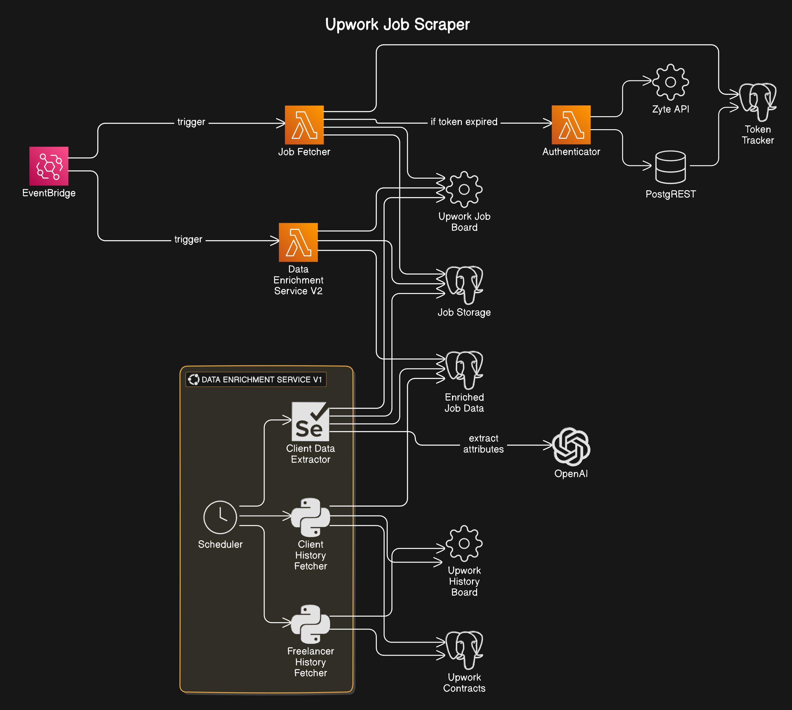

# Upwork Job Scraper Ecosystem

This repository consists of a comprehensive job scraping ecosystem designed to interact with the Upwork Job Board. The ecosystem incorporates various microservices for authentication, job fetching, and data enrichment. This setup ensures an efficient workflow with a focus on cost-effectiveness and modular design.

## Table of Contents

- [Overview](#overview)
- [Microservices](#microservices)
- [Authenticator Lambda](#authenticator-lambda)
- [Job Fetcher Lambda](#job-fetcher-lambda)
- [Data Enrichment Service](#data-enrichment-service)
- [Architecture Diagram](#architecture-diagram)
- [Cost Efficiency](#cost-efficiency)

## Overview

The Upwork Job Scraper Ecosystem enables the collection, enrichment, and storage of job postings from the Upwork Job Board. Each microservice plays a distinct role in this workflow:

1. **Authenticator Lambda**: Retrieves and manages authentication tokens required for accessing the Upwork API.
2. **Job Fetcher Lambda**: Fetches job postings from Upwork utilizing the token and stores them in a PostgreSQL database.
3. **Data Enrichment Service**: Enriches retrieved job postings by adding additional information (client statistics) to enhance data quality for downstream usage.

## Microservices

### Authenticator Lambda

**Responsibilities:**

- Retrieves an authentication token from the Upwork API.
- Caches the token in the PostgreSQL database via PostgREST.
- Validates requests to ensure secure access to job-fetching processes.

### Job Fetcher Lambda

**Responsibilities:**

- Scheduled to extract **ALL** job postings from the Upwork Job Board.
- Updates the PostgreSQL database with job postings, handling an average of around **6,000 job postings per day**.
- Utilizes the cached authentication token from the Authenticator Lambda; if the token is expired, it fetches a new one.

### Data Enrichment Service

**Responsibilities:**

- Enriches job postings with client data, enhancing the overall quality of the data available.
- Provides two versions of enrichment:
- **Version 1**: Operates locally and requires a logged-in Upwork account. This version is more expensive but ensures 100% data enrichment.
- **Version 2**: A serverless implementation using AWS Lambda, offering a cost-effective method for data enrichment.
- In cases where Version 2 fails to enrich data, Version 1 steps in to guarantee completion.

## Architecture Diagram

## Cost Efficiency

The ecosystem is designed with cost efficiency in mind:

- The Authenticator Lambda caches tokens in PostgreSQL to minimize repeated fetches from the Zyte.
- The Job Fetcher Lambda operates on a scheduled basis, reducing the frequency of API calls to the Upwork Job Board.
- The Data Enrichment Service augments job postings without requiring constant fetching from the Upwork API, allowing for enhanced data quality while managing costs effectively.

With a well-structured architecture, the Upwork Job Scraper Ecosystem ensures efficient management of job postings, provides enriched data for analysis, and securely handles authentication throughout the process.
